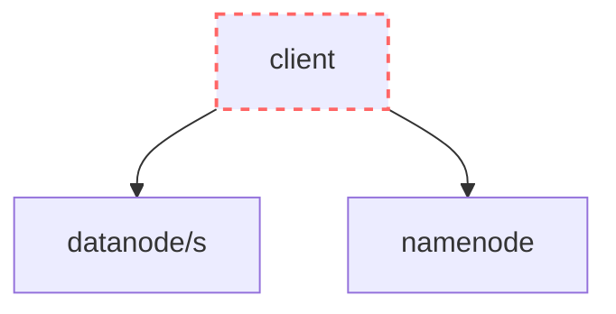

# Building HDFS from scratch with Python

The goal of this lab is to build a distributed file storage system that allows the user to upload and download files, which we will call SSHDFS (Super Simple HDFS). This lab is inspired by [The Hadoop Distributed File System (2010)](https://pages.cs.wisc.edu/~akella/CS838/F15/838-CloudPapers/hdfs.pdf).


# Grade

Requirements are divided into categories to help you prioritize.

| Weight               | Description                              | Symbol   |
|----------------------|------------------------------------------|----------|
| 40% | Essential, needed to get something working       | (^)      |
| 30% | Nice-to-haves, not required to get something working | (^^)     |
| 30% | Difficult, complex exercises             | (^^^)    |
| +1.5/10 (extra) | Advanced, challenges for diving deep       | (^^^^)   |

# Submit for grading

When you have finished the project, follow these steps to submit it for grading:

1. In [submission.json](./submission.json), add a list of all exercises you have completed. If you don't add them, they won't be graded. For example:

    ```json
    [
        "1.1.1",
        "1.1.2",
        "1.1.3",
        "1.2.1",
        "1.2.6"
    ]
    ```
    
2. Make sure the basic tests are passing in the `Actions` tab in GitHub

4. Submit a link to the repository in the Aula Global task

# Work breakdown

## [1.1] FastAPI, Docker and Docker Compose

> [!IMPORTANT]
> You will learn how to code APIs with FastAPI and deploy them with Docker.

### [1.1.1] Starting a containerized service

Run [fastapi-quickstart](../../resources/fastapi-quickstart/) using `docker compose up --build`.

- This starts a Python API service and runs it inside a Docker container.
- The [main.py](../../resources/fastapi-quickstart/app/main.py) file implements 3 API endpoints.
- The [compose.yaml](../../resources/fastapi-quickstart/compose.yaml) file describes how to build a Docker container with the API and which port to run it on. 
- `ports: "8000:80"` means forward all traffic of port 8000 in this computer to port 80 inside the Docker container.

Use `curl` to send an HTTP request to the service and receive its response:

```zsh
curl "http://localhost:8000/info"
```

### [1.1.2] Implementing your first endpoint

Extend the service with a new endpoint: `POST /sum`.

The sum endpoint must receive a [JSON object with two numbers in the body](https://fastapi.tiangolo.com/tutorial/body/) and return the sum.

```
POST http://localhost:8000/sum
```

Body:
```json
{
    "x": 23,
    "y": 32
}
```

Response:
```json
{
    "result": 55
}
```

When you have implemented it, rebuild and start the service with `docker compose up --build`.

Finally, use `curl` to send the HTTP request to the service and receive its response:

```zsh
curl -X POST "http://localhost:8000/sum" --json '{
    "x":23, 
    "y": 32
}'
```


### [1.1.3] Implementing your second endpoint

Extend the service with a new endpoint: `POST /multiply/{a}/{b}`.

The multiply endpoint must receive a [JSON object with two numbers in the path](https://fastapi.tiangolo.com/tutorial/path-params/) and return the multiplication.

```
POST http://localhost:8000/multiply/2/6
```

Response:
```json
{
    "result": 12
}
```

When you have implemented it, rebuild and start the service with `docker compose up --build`.

Finally, use `curl` to send the HTTP request to the service and receive its response:

```zsh
curl -X POST "http://localhost:8000/multiply/4/5"
```

## [1.2] Namenode

> [!IMPORTANT]
> You will build the `namenode` service as described in [namenode](#namenode). The `namenode` service has an API that allows creating files, adding blocks to files and reading the file metadata.


### [1.2.1] Healthcheck (^)

Create a folder `namenode` with a FastAPI service and its Dockerfile. Create a Docker Compose file as well that brings up 1 `namenode` service in port 8000.

Implement a basic `/healthcheck` endpoint that always returns this:

```json
{
    "status": "up"
}
```

<details>
<summary>Sanity check</summary>

**test**

```zsh
docker compose up --build
```

```zsh
curl "http://localhost:8000/healthcheck" -s | jq
```

**expected**
```json
{
    "status": "up"
}
```
</details>


### [1.2.2] Listing datanodes (^)

Implement the first endpoint of the `namenode` API: [GET /datanodes](#get-datanodes).
- You must create a [settings.json](#namenode-filesystem) file with the namenode configuration.
- Your code must [read](https://python.land/data-processing/working-with-json#How_to_read_a_JSON_file_in_python) the configured `datanodes` from the [settings.json](#namenode-filesystem) file and return them for each request.


<details>
<summary>Sanity check</summary>

**test**

```zsh
docker compose up --build
```

```zsh
curl "http://localhost:8000/datanodes" -s | jq
```

**expected**
```json
{
    "datanodes": [
        {
            "id": "1",
            "host": "localhost",
            "port": 8001
        },
        {
            "id": "2",
            "host": "localhost",
            "port": 8002
        },
        {
            "id": "3",
            "host": "localhost",
            "port": 8003
        }
    ]
}
```

</details>

### [1.2.3] Creating files (^)

Implement the [POST /files](#post-files) endpoint.

- New files have no blocks by default.
- Make sure you handle edge cases properly (empty file name, file name that already exists, ...)
- [Write](https://python.land/data-processing/working-with-json#How_to_write_JSON_to_a_file_in_python) the [metadata of the new file to `checkpoint.json`](#namenode-filesystem).


<details>
<summary>Sanity check</summary>

**test**
```zsh
curl -X POST "http://localhost:8001/files" --json '{
    "file_name": "myfile.jpg"
}' -s | jq
```

**expected**
```json
{
    "file_name": "myfile.jpg",
    "block_size_bytes": 1000000,
    "blocks": []
}
```
</details>


### [1.2.4] Retrieving files (^)

Implement the [GET /files/{filename}](#get-filesfilename) endpoint. 

- [Read the file name being requested from the URL path](https://fastapi.tiangolo.com/tutorial/path-params/)
- Read and return the file metadata from the [checkpoint.json](#namenode-filesystem) file.

Make sure you test it works with `curl`.

### [1.2.5] Adding blocks to files (^)

Implement the [POST /files/{filename}/blocks](#post-filesfilenameblocks) endpoint to allow appending a new block to a file.

- [Read](https://python.land/data-processing/working-with-json#How_to_read_a_JSON_file_in_python) the [number of replicas, `datanodes` and block size from `settings.json`](#namenode-filesystem).
- Choose which `datanodes` will host replicas of the block using the [basic placement policy](#block-and-replica-placement).
- Update the [metadata of the file in `checkpoint.json`](#namenode-filesystem) to add the new block.

Make sure you test it works with `curl`.

### [1.2.6] Deleting files (^^)

Implement the [DELETE /files/{filename}](#delete-filesfilename) endpoint. 

- [Read the file name being requested from the URL path](https://fastapi.tiangolo.com/tutorial/path-params/)
- Remove the file metadata from the [checkpoint.json](#namenode-filesystem) file.

Make sure you test it works with `curl`.

### [1.2.7] The journal (^^^)

The goal of this exercise is to avoid writing and reading the full `checkpoint.json` file for every change (e.g. new file, block or deletion). Instead, implement a write-ahead-log (the journal) for every change.

- When the `namenode` starts:
    - Create an empty `journal.log` file if it not exists.
    - Go through every line in the journal file and load it into the in-memory image (a dictionary).
    - Store the image to the `checkpoint.json` and empty the `journal.log`.
- Whenever a file is created, a block is added or a file is removed:
    - Append it to the journal first
    - Then update the in-memory image
    
This is an example of a checkpoint, the journal and the image you can build after reading both:

```json
{
    "cat.jpg": {
        "file_name": "cat.jpg",
        "block_size_bytes": 1000000,
        "blocks": [
            {
                "number": 0,
                "replicas": [ "1", "2" ]
            }
        ]
    },
    "test.txt": {
        "file_name": "test.txt",
        "block_size_bytes": 1000000,
        "blocks": [
            {
                "number": 0,
                "replicas": [ "1" ]
            }
        ]
    }
}
```

```
2 create-block {"file_name":"myfile.jpg","number":1,"replicas":["2","3"]}
3 create-file {"file_name":"somefile.txt","block_size_bytes":1000000}
4 create-block {"file_name":"myfile.jpg","number":2,"replicas":["3","1"]}
5 create-block {"file_name":"somefile.txt","number":0,"replicas":["1","2"]}
6 delete-file {"file_name":"test.txt"}
```

```json
{
    "cat.jpg": {
        "file_name": "cat.jpg",
        "block_size_bytes": 1000000,
        "blocks": [
            {
                "number": 0,
                "replicas": [ "1", "2" ]
            },
            {
                "number": 1,
                "replicas": [ "2", "3" ]
            },
            {
                "number": 2,
                "replicas": [ "3", "1" ]
            }
        ]
    },
    "somefile.txt": {
        "file_name": "somefile.txt",
        "block_size_bytes": 1000000,
        "blocks": [
            {
                "number": 0,
                "replicas": [ "1", "2" ]
            }
        ]
    }
}
```

## [1.3] Datanode

> [!IMPORTANT]
> You will build the `datanode` service as described in [datanode](#datanode). The `datanode` service has an API that allows storing and reading blocks.

### [1.3.1] Healthcheck (^)

Create a `datanode` folder with a new FastAPI service and its Dockerfile. Then, add three replicas of the `datanode` service in the Docker Compose file in ports 8001, 8002 and 8003.

Implement a basic `/healthcheck` endpoint that always returns this:

```json
{
    "status": "up"
}
```

<details>
<summary>Sanity check</summary>

**test**

```zsh
docker compose up --build
```

```zsh
curl "http://localhost:8001/healthcheck" -s | jq
curl "http://localhost:8002/healthcheck" -s | jq
curl "http://localhost:8003/healthcheck" -s | jq
```

**expected**
```json
{
    "status": "up"
}
{
    "status": "up"
}
{
    "status": "up"
}
```
</details>


### [1.3.2] Writing blocks (^)

Implement the [PUT /files/{filename}/blocks/{block_number}](#put-filesfilenameblocksblock_number) endpoint. 

- When a new block is PUT, you must [read the file name and block number from the URL path](https://fastapi.tiangolo.com/tutorial/path-params/). 
- Then, the `datanode` must [store it in its file system](#datanode-filesystem) at the path `datanode/storage/<filename>/<block_number>`.

> [!TIP]
> You can [use the `UploadFile` object to receive files](https://fastapi.tiangolo.com/tutorial/request-files/#define-file-parameters).

> [!TIP]
> You can use the [`open` and `write`](https://www.geeksforgeeks.org/python-write-bytes-to-file/) functions to write bytes to a new file. 

Test you can upload some of the test blocks: `curl -F "file=@./test_files/test-block-text" -X PUT localhost:8001/files/test-file.txt/blocks/0`. Finally, open the `Files` tab in `Docker Desktop` and verify the block is successfully stored there.

### [1.3.3] Reading blocks (^)

Implement the [GET /files/{filename}/blocks/{block_number}](#get-filesfilenameblocksblock_number) endpoint. 

- Read the file name and block number [from the URL path](https://fastapi.tiangolo.com/tutorial/path-params/). 
- When a block is GET, the `datanode` must read it from [its file system](#datanode-filesystem) at the path `datanode/storage/<filename>/<block_number>`. 
    
> [!TIP]
> You can [use the `FileResponse` object to return files](https://fastapi.tiangolo.com/advanced/custom-response/#fileresponse).

Test you can download the test block we uploaded before with curl: `curl -o downloaded-test-block.txt -X GET localhost:8001/files/test-file.txt/blocks/0`.

### [1.3.4] Write pipelines (^^^)

Extend the `PUT /files/{filename}/blocks/{block_number}` endpoint to allow sending the next `datanode` ids in the write pipeline as a query parameter.

For example:
- Datanode 1 receives a block in (i.e. you send `PUT http://localhost:8001/files/cat.jpg/blocks/0?pipeline=2,3`)
- Datanode 1 stores the block in its file system.
- Datanode 1 sends the block to the next datanode in the pipeline: `PUT http://localhost:8002/files/cat.jpg/blocks/0?pipeline=3` 
- Datanode 2 stores the block in its file system.
- Datanode 2 sends the block to the next datanode in the pipeline: `PUT http://localhost:8002/files/cat.jpg/blocks/0?pipeline=3` 
- Datanode 3 stores the block in its file system.

> [!TIP]
> You can additional function arguments to read [query parameters](https://fastapi.tiangolo.com/tutorial/query-params/).

> [!TIP]
> You can use [httpx](https://www.python-httpx.org/quickstart/) to make HTTP requests with Python.

> [!TIP]
> Read more about [Networking in Compose](https://docs.docker.com/compose/how-tos/networking/) to understand how your different services can communicate.

### [1.3.5] Handling deleted files (^^^^)

Send a block report from each `datanode` to the `namenode` every 30 seconds:
- Add an endpoint in the API of the `namenode` to receive the block reports.
- The `namenode` must answer the request with any blocks which should be removed
- The `datanode` should then remove all blocks that have been indicated for removal by the `namenode`.

To do so continuously in the background, you may use code like this:

```python
async def background_loop():
    while True:
        logging.info("Here!")
        await asyncio.sleep(1)

@app.on_event("startup")
async def schedule_periodic():
    loop = asyncio.get_event_loop()
    loop.create_task(background_loop())
```

### [1.3.6] Handling underreplicated blocks (^^^^)

When you receive a block report from a `datanode`, extend the `namenode` implementation to:
- Keep track of which blocks are stored in each `datanode` in a dictionary
- If a block that was stored in a `datanode` is no longer stored there in a following block report, check if the block has enough replicas
- If it is underreplicated, add it to a replication queue
- Answer the next block report from a `datanode` by instructing them to send a copy of undereplicated blocks they own to another `datanode` 


### [1.3.7] Handling down datanodes (^^^^)

Keep track of the last time a `datanode` has sent a block report. If none has been received in the last 90 seconds, treat all the block replicas in that `datanode` as missing and add them to the replication queue.


## [1.4] Client

> [!IMPORTANT]
> You will build a [Python client](#client) which allows uploading and download files as blocks from SSHDFS. When uploading a file, the client is in charge of dividing the file into blocks and uploading each of them. When downloading a file, the client is in charge of appending all the downloaded blocks together in the final file.

### [1.4.1] List datanodes (^^)

Create a folder `client` with a Python script: `list_datanodes.py` and a `requirements.txt` file with any libraries it needs to run. 

`list_datanodes.py` must retrieve all the `datanodes` from the `namenode` and prints their host and port:
- Retrieve the id, host and port of each `datanode` [using the `namenode` API](#get-datanodes). 
- Then, print each of them in a line using this format: `<id>@<host>:<port>`

For example:
```
1@localhost:8001
2@localhost:8002
3@localhost:8003
```

> [!TIP]
> You can use [httpx](https://www.python-httpx.org/quickstart/) to make HTTP requests with Python. See `JSON Response Content`.

### [1.4.2] Upload a file (^^)

Create a new Python script `upload.py <source_path> <sshdfs_file_name>`. It creates a new file in the `namenode`, creates the necessary blocks according to the block size, and uploads each block to the first `datanode` that the `namenode` assigned:

- Use [sys.argv](https://www.geeksforgeeks.org/how-to-use-sys-argv-in-python/) to read the source path and filename parameters.
- [Check the file size](https://stackoverflow.com/questions/2104080/how-do-i-check-file-size-in-python)
- Create the file using the [POST /files](#post-files) endpoint in the `namenode` API.
- Read [the bytes of the file](https://stackoverflow.com/questions/1035340/reading-binary-file-and-looping-over-each-byte). For each block:
    - Read `block_size_bytes` from the file
    - Add a new block to the file using the [POST /files/{filename}/blocks](#post-filesfilenameblocks) endpoint in the `namenode` API. 
    - Upload the block the the first `namenode` using the [PUT /files/{filename}/blocks/{block_number}](#put-filesfilenameblocksblock_number). If you have implemented write pipelines, remember to send the proper `pipeline` query parameter for them to work.

> [!TIP]
> You can use the [files parameter](https://www.slingacademy.com/article/python-how-to-upload-files-with-httpx-form-data/) to upload bytes with HTTPX.

Run the `upload.py` script and make sure it works (i.e. if you open the `Files` tab in Docker Desktop you can see all the blocks properly uploaded).

### [1.4.3] Download a file (^^)

Create a new Python script `download.py <hdfs_file_name> <destination_path>` that downloads all the blocks from the `datanodes` and writes them all together to the destination path as the complete file:
- First, retrieve the file metadata using the [GET /files/{filename}](#get-filesfilename) endpoint of the `namenode` API. 
- Then, use the [GET /files/{filename}/blocks/{block}](#get-filesfilenameblocksblock_numbercontent) endpoint of the `datanode` API to download each block from one of the replicas.
- Finally, [write all blocks as one final file](https://www.geeksforgeeks.org/python-write-bytes-to-file/).
- Make sure you gracefully handle replica failures.

> [!TIP]
> See `Binary Response Content` in the [httpx](https://www.python-httpx.org/quickstart) docs.  

Run the `upload.py` and `download.py` scripts and make sure you can upload and download a full file successfully.

### [1.4.4] Client failover (^^)

If a `datanode` fails when uploading or downloading a file, use any of the other `datanodes` in the replica list.

# Design

SSHDFS is composed of 2 services and 1 client:
- The [**client**](#client) allows the user to upload and download files from SSHDFS.
- The [**datanode** service](#datanode) stores blocks.
- The [**namenode** service](#namenode) stores which blocks compose a file and which `datanode` has each block.

The following diagram represents the dependencies in the system. For example, `client --> datanode` indicates that `client` depends on `datanode` (`client` uses the API of `datanode`).



### client

In SSHDFS, files are divided into blocks before being stored. A block is a chunk of the file. For example, if we configure the block size of SSHDFS as 100 bytes, then to store a file that weights 295 bytes we will divide the file in 3 blocks: block 1 (0 - 100 bytes), block 2 (100 - 200 bytes) and block 3 (200 - 295 bytes).

#### Uploading files

To upload a file, the client first creates the file in the `namenode`. Then, it divides the file into blocks. Then, it creates each block using the `namenode` API and sends each block to the corresponding `datanode`. 

#### Downloading files

To download a file, the client fetches each blocks from the corresponding `datanode`. Then, it reassembles the original file by writing the blocks to a new file in the correct order.

### namenode

In SSHDFS, there is exactly 1 instance of the `namenode` in the system. I.e., the `namenode` is scaled vertically.

In order for the `client` to create or retrieve a file from SSHDFS, the `namenode` exposes an HTTP REST API. The API for the `namenode` only allows four operations:
- [Get a list of datanodes in the system](#get-datanodes)
- [Create a new file](#post-files)
- [Add a block to a file](#post-files-blocks)
- [Get the information from an existing file](#get-filesfilename)

#### namenode filesystem

The namenode stores all its data in two files: `settings.json` and `checkpoint.json`.

The `namenode` reads the `settings.json` file to get the system configuration, including the datanodes, replication factor and block size (in bytes).

```json
{
    "datanodes": [
        {
            "id": "1",
            "host": "localhost",
            "port": 8001
        },
        {
            "id": "2",
            "host": "localhost",
            "port": 8002
        },
        {
            "id": "3",
            "host": "localhost",
            "port": 8003
        }
    ],
    "replication_factor": 1,
    "block_size_bytes": 1000000
}
```


The `namenode` writes to the `checkpoint.json` file every file that is created in the system. At the beginning, the `checkpoint.json` file is an empty object (`{}`). But when a client creates a file, the `namenode` stores the file metadata like in the following example. 

```json
{
    "cat.jpg": {
        "file_name": "cat.jpg",
        "block_size_bytes": 1000000,
        "blocks": [
            {
                "number": 0,
                "replicas": [ "1", "2" ]
            },
            {
                "number": 1,
                "replicas": [ "2", "3" ]
            },
            {
                "number": 2,
                "replicas": [ "3", "1" ]
            }
        ]
    },
    "somefile.txt": {
        "file_name": "somefile.txt",
        "block_size_bytes": 1000000,
        "blocks": [
            {
                "number": 0,
                "replicas": [ "1", "2" ]
            }
        ]
    }
}
```

If the `replication_factor` of the system is higher than one, the `replicas` array stores the id of each `datanode` that has a replica of the block. Otherwise, the `replicas` array contains a single `datanode` id.

#### GET /datanodes

The client can retrieve all `datanodes` configured in SSHDFS using the `datanodes` endpoint.

For example, the `client` can retrieve all `datanodes` configured in the `namenode` with address `localhost:8000` as follows:

```
GET http://localhost:8000/datanodes
```

Response:
```json
{
    "datanodes": [
        {
            "id": "1",
            "host": "localhost",
            "port": 8001
        },
        {
            "id": "2",
            "host": "localhost",
            "port": 8002
        },
        {
            "id": "3",
            "host": "localhost",
            "port": 8003
        }
    ]
}
```

#### POST /files

POSTing to `/files` creates a new file in the `namenode`. Use the `block_size_bytes` configured in `settings.json`.

For example, the `client` can create a file called `myfile.jpg` in the `namenode` with address `localhost:8000`as follows:

```
POST http://localhost:8000/files
```

Body:
```json
{
    "file_name": "myfile.jpg"
}
```

Response:
```json
{
    "file_name": "myfile.jpg",
    "block_size_bytes": 1000000,
    "blocks": []
}
```

If the file already exists in the `namenode`, the response must be a 409.

#### POST /files/{filename}/blocks

POSTing to `/files/{filename}/blocks` adds a block to an existing file.

For example, the `client` can add a block to the file `myfile.jpg` in the `namenode` with address `localhost:8000` as follows:

```
POST http://localhost:8000/files/myfile.jpg/blocks
```

Body:
```json
{
}
```

Response:
```json
{
    "file_name": "myfile.jpg",
    "block_size_bytes": 1000000,
    "blocks": [
        {
            "number": 0,
            "replicas": [ "1", "2" ]
        }
    ]
}
```

If the file does not exist in the `namenode`, the response must be a 404.


##### block and replica placement

In SSHDFS, we will use a very simple block and replica placement strategy.

The first block of a file will always be stored in datanode 1. Then, all the following blocks will be assigned using the modulo operator: `datanode_index = (block_number % total_datanodes)`.

For example, consider a system with 3 `datanodes`, `block_size=100` and `replication_factor=1`. Then, if a client wants to store a file that weights 495 bytes:
- File is divided in 5 blocks: block 1 (0 - 100 bytes), block 2 (100 - 200 bytes), block 3 (200 - 300 bytes), block 4 (300 - 400 bytes) and block 5 (400 - 495 bytes)
- We assign each block to a datanode using the modulo operation:
    - block 1 replica 1 (datanode 1)
    - block 2 replica 1 (datanode 2)
    - block 3 replica 1 (datanode 3)
    - block 4 replica 1 (datanode 1)
    - block 5 replica 1 (datanode 2)

To place replicas, we will use a similar logic. Each replica will be placed to the next `datanode`: `datanode_index = ((first_replica_datanode_index + replica_number) % total_datanodes)`.

For example, consider a system with 3 `datanodes`, `block_size=100` and `replication_factor=2`. Then, if a client wants to store a file that weights 295 bytes:
- File is divided in 3 blocks: block 1 (0 - 100 bytes), block 2 (100 - 200 bytes), block 3 (200 - 295 bytes)
- We assign each block and replica to a datanode using the modulo operation:
    - block 1 replica 1 (datanode 1), block 1 replica 2 (datanode 2)
    - block 2 replica 1 (datanode 2), block 2 replica 2 (datanode 3)
    - block 3 replica 1 (datanode 3), block 3 replica 2 (datanode 1)


#### POST /block_report

POSTing to `/block_report` is used by each `datanode` to send block reports to the `namenode`. The body of the request contains all the blocks stored in the datanode. The body of the response contains all blocks the `namenode` has decided this `datanode` should remove (because they are overreplicated or the fila has been removed) or send to another `datanode` (because they are underreplicated).

For example:

```
POST http://localhost:8000/block_report
```

Body:
```json
{
    "blocks": [
        {
            "file_name": "myfile.jpg",
            "block_number": 0
        },
        {
            "file_name": "myfile.jpg",
            "block_number": 1
        },
        {
            "file_name": "another-file.txt",
            "block_number": 1
        }
    ]
}
```

Response:
```json
{
    "blocks_to_replicate": [
        {
            "file_name": "another-file.txt",
            "block_number": 1,
            "destination_datanode_id": "2"
        }
    ],
    "blocks_to_remove": [
        {
            "file_name": "myfile.jpg",
            "block_number": 1
        }
    ]
}
```


#### GET /files/{filename}

GETting `/files/{filename}` retrieves the file metadata from the `namenode`. 

For example, the `client` can retrieve all the information about a file called `myfile.jpg` from the `namenode` with address `localhost:8000` as follows:

```
GET http://localhost:8000/files/myfile.jpg
```

Response:
```json
{
    "file_name": "myfile.jpg",
    "block_size_bytes": 1000000,
    "blocks": [
        {
            "number": 0,
            "replicas": [ "1" ]
        },
        {
            "number": 1,
            "replicas": [ "2" ]
        },
        {
            "number": 2,
            "replicas": [ "3" ]
        }
    ]
}
```

If the file does not exist in the `namenode`, the response must be a 404.

#### DELETE /files/{filename}

DELETEing `/files/{filename}` removes the file from the `namenode`. 

For example, the `client` can delete a file called `myfile.jpg` from the `namenode` with address `localhost:8000` as follows:

```
DELETE http://localhost:8000/files/myfile.jpg
```

Response: 204

If the file does not exist in the `namenode`, the response must be a 404.

### datanode

In SSHDFS, there are many instances of the `datanode`. I.e., the `datanode` is scaled horizontally.

In order for the `client` to upload and download blocks from the `datanode`, the `datanode` exposes an HTTP API. The API for the `datanode` only allows two operations:
- [Upload a block](#put-filesfilenameblocksblock_number)
- [Download a block](#get-filesfilenameblocksblock_number)

#### datanode filesystem

When a block is stored in a `datanode` server, the block is persisted to the file system. Blocks are persisted to the path `datanode/storage/<filename>/<block_number>`. In other words, we create one folder with the name of each file the `datanode` stores, and we store the blocks inside the folder, each in a file with the block number as its name (without extension). For example, the file system of a `datanode` that stores blocks 0 and 23 of the file `cat1.jpg`, block 5 of the file `cat29.jpg` and blocks 2 and 22 of the file `cat3.jpg` looks as follows:
```
/datanode
    /storage
        /cat1.jpg
            0
            23
        /cat3.jpg
            2
            22
        /cat29.jpg
            5
``` 

#### PUT /files/{filename}/blocks/{block_number}

PUTting a block to `/files/{filename}/blocks/{block_number}` uploads it to the `datanode`. 

For example, to upload the block `0` of a file named `myfile.jpg` in the `datanode` with address `localhost:8081`, the `client` must send a request with the block [attached as a file](https://api4.ai/blog/how-to-post-a-file-via-http-request) to `PUT http://localhost:8081/files/myfile.jpg/blocks/0`.

You can implement write pipelines (^^^) by allowing an additional query parameter: `/files/{filename}/blocks/{block_number}?pipeline=2,3` which specifies which `datanodes` should this block be forwarded to.

#### GET /files/{filename}/blocks/{block_number}

GETting a block from `/files/{filename}/blocks/{block_number}` downloads it from the `datanode`. 

For example, to download the block `0` of a file named `myfile.jpg` from the `datanode` with address `localhost:8081`, the `client` must send a request to `GET http://localhost:8081/files/myfile.jpg/blocks/0`.

If the block does not exist in the `datanode`, the response must be a 404.
