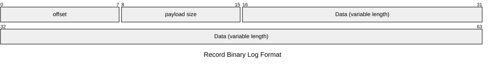

# Building Kafka from scratch with Python

The goal of this lab is to build a distributed data store which allows consuming and producing in realtime, which we will call SSKafka (Super Simple Kafka). This lab is inspired by [Kafka: a Distributed Messaging System for Log Processing (2011)](https://www.microsoft.com/en-us/research/wp-content/uploads/2017/09/Kafka.pdf) and [KIP-595: A Raft Protocol for the Metadata Quorum (2020)](https://cwiki.apache.org/confluence/display/KAFKA/KIP-595%3A+A+Raft+Protocol+for+the+Metadata+Quorum).

# Grade

Requirements are divided into categories to help you prioritize.

| Weight               | Description                              | Symbol   |
|----------------------|------------------------------------------|----------|
| 40% | Essential, needed to get something working       | (^)      |
| 30% | Nice-to-haves, not required to get something working | (^^)     |
| 30% | Difficult, complex exercises             | (^^^)    |
| +3/10 (extra) | Advanced, challenges for diving deep       | (^^^^)   |

# Submit for grading

When you have finished the project, follow these steps to submit it for grading:

1. In [submission.json](./submission.json), add a list of all exercises you have completed. If you don't add them, they won't be graded. For example:

    ```json
    [
        "1.1.1",
        "1.1.2",
        "1.1.3",
        "1.2.1",
        "1.2.6"
    ]
    ```
    
2. Make sure the basic tests are passing in the `Actions` tab in GitHub

4. Submit a link to the repository in the Aula Global task

# Work breakdown

This section presents a step by step work breakdown to help you implement SSKafka. Refer to the [Design](#design) section for the full system design reference.

## [4.1] Control plane: implementing the broker Admin API

> [!IMPORTANT]
> The goal of this lab is to implement a basic broker service which allows you to create and list topics through its API. When the admin API is ready, you will implement some Python client scripts which use it to make creating and listing topics easier.

### [4.1.1] Run 5 brokers in Docker Compose (^)

Bootstrap a FastAPI service for the broker with a single [GET /healthcheck](#get-healthcheck) endpoint.

Then, create a `docker-compose.yaml` file with 5 brokers in ports 8001 (leader), 8002 (follower), 8003 (follower), 8004 (follower) and 8005 (follower). For now, 8001 will always be the lesder of the cluster.


> [!TIP]
> You can configure the broker_id and the leader_broker_id by passing environment variables from [Docker Compose](https://docs.docker.com/compose/how-tos/environment-variables/set-environment-variables/) to [Python](https://stackoverflow.com/a/4907053).


<details>
<summary>Sanity check</summary>

**test**

```zsh
docker compose up --build
```

```zsh
curl "http://localhost:8001/healthcheck" -s | jq
curl "http://localhost:8002/healthcheck" -s | jq
curl "http://localhost:8003/healthcheck" -s | jq
curl "http://localhost:8004/healthcheck" -s | jq
curl "http://localhost:8005/healthcheck" -s | jq
```

**expected**
```json
{
  "status": "up",
  "broker_id": 1,
  "leader_broker_id": 1
}
{
  "status": "up",
  "broker_id": 2,
  "leader_broker_id": 1
}
{
  "status": "up",
  "broker_id": 3,
  "leader_broker_id": 1
}
{
  "status": "up",
  "broker_id": 4,
  "leader_broker_id": 1
}
{
  "status": "up",
  "broker_id": 5,
  "leader_broker_id": 1
}
```

</details>

### [4.1.2] Implement admin API for creating topics (^)

Implement the [POST /admin/v1/topics](#post-adminv1topics) endpoint. You should persist every created topic in the [__cluster_metadata.log](#metadata-log) file.

> [!TIP]
> You can append to the end of the `__cluster_metadata.log` file with the ["a" mode](https://stackoverflow.com/a/4706520) in Python.

> [!TIP]
> You can use [json.dumps](https://www.w3schools.com/python/python_json.asp) to serialize a Python dictionary to a JSON string.

We recommend that you implement a separate class to handle the metadata log:

```python
class KRaft:
    def _load_metadata_log(self):
        # TODO, implement in 4.1.2
        
    def __init__(self):
        # TODO
    
    def append_to_metadata_log(self, action):
        # TODO, implement in 4.1.2

    def read_metadata_log(self, from_offset, max_batch_size):
        # TODO, implement in 4.1.3
```

<details>
<summary>Sanity check</summary>

**test**

```zsh
curl -X POST "http://localhost:8001/admin/v1/topics" -H 'Content-Type: application/json' -d '{
    "topic_name": "testtopic",
    "partition_count": 3
}' -s | jq
curl -X POST "http://localhost:8001/admin/v1/topics" -H 'Content-Type: application/json' -d '{
    "topic_name": "testtopic",
    "partition_count": 3
}' -s | jq
curl -X POST "http://localhost:8002/admin/v1/topics" -H 'Content-Type: application/json' -d '{
    "topic_name": "testtopic",
    "partition_count": 3
}' -s | jq
```

**expected**
```json
{
  "topic_name": "testtopic",
  "partitions": [
    {
      "id": "testtopic-1",
      "replica_brokers": ["1", "2", "3", "4", "5"]
    },
    {
      "id": "testtopic-2",
      "replica_brokers": ["1", "2", "3", "4", "5"]
    },
    {
      "id": "testtopic-3",
      "replica_brokers": ["1", "2", "3", "4", "5"]
    }
  ]
}
{
  "detail": "topic testtopic already exists"
}
{
  "detail": "leader is 1, can't accept"
}
```

</details>

### [4.1.3] Implement admin API for listing topics (^)

Implement the [GET /admin/v1/topics](#get-adminv1topics) endpoint. You should read the topics from the [__cluster_metadata.log](#metadata-log) file.


<details>
<summary>Sanity check</summary>

**test**
```zsh
curl -X POST "http://localhost:8001/admin/v1/topics" -H 'Content-Type: application/json' -d '{
    "topic_name": "testtopic",
    "partition_count": 3
}' -s | jq
curl -X POST "http://localhost:8001/admin/v1/topics" -H 'Content-Type: application/json' -d '{
    "topic_name": "othertopic",
    "partition_count": 3
}' -s | jq
curl -X GET "http://localhost:8001/admin/v1/topics" -s | jq
```

**expected**
```json
{
  "topic_name": "testtopic",
  "partitions": [
    {
      "id": "testtopic-1",
      "replica_brokers": ["1", "2", "3", "4", "5"]
    },
    {
      "id": "testtopic-2",
      "replica_brokers": ["1", "2", "3", "4", "5"]
    },
    {
      "id": "testtopic-3",
      "replica_brokers": ["1", "2", "3", "4", "5"]
    }
  ]
}
{
  "topic_name": "othertopic",
  "partitions": [
    {
      "id": "othertopic-1",
      "replica_brokers": ["1", "2", "3", "4", "5"]
    },
    {
      "id": "othertopic-2",
      "replica_brokers": ["1", "2", "3", "4", "5"]
    },
    {
      "id": "othertopic-3",
      "replica_brokers": ["1", "2", "3", "4", "5"]
    }
  ]
}
{
  "topics": [
    {
      "topic_name": "testtopic",
      "partitions": [
        {
          "id": "testtopic-1",
          "replica_brokers": ["1", "2", "3", "4", "5"]
        },
        {
          "id": "testtopic-2",
          "replica_brokers": ["1", "2", "3", "4", "5"]
        },
        {
          "id": "testtopic-3",
          "replica_brokers": ["1", "2", "3", "4", "5"]
        }
      ]
    },
    {
      "topic_name": "othertopic",
      "partitions": [
        {
          "id": "othertopic-1",
          "replica_brokers": ["1", "2", "3", "4", "5"]
        },
        {
          "id": "othertopic-2",
          "replica_brokers": ["1", "2", "3", "4", "5"]
        },
        {
          "id": "othertopic-3",
          "replica_brokers": ["1", "2", "3", "4", "5"]
        }
      ]
    }
  ]
}
```
</details>


### [4.1.4] Implement admin API for deleting a topic (^^)

Implement the [DELETE /admin/v1/topics/{topic_name}](#delete-adminv1topicstopic_name) endpoint. You should persist every deleted topic to the [metadata.log](#metadata-log) file.

> [!WARNING]
> Make sure the `GET /admin/v1/topics` endpoint works as expected after removing a topic.

### [4.1.5] Implement a Python client to create topics (^^)

Create a folder `client` with the following files: `requirements.txt` and `create_topic.py`. Then, implement the [create_topic.py](#create_topicpy) client script.

> [!TIP]
> You may use [argparse](https://thepythoncode.com/article/how-to-use-argparse-in-python#simple-example) to implement the client script.

> [!TIP]
> You may use [httpx](https://www.python-httpx.org/quickstart/#sending-json-encoded-data) to make an HTTP request using Python. Remember to add it to the `requirements.txt` file.

<details>
<summary>Sanity check</summary>

**test**

```zsh
cd client
python3 -m venv venv
source venv/bin/activate
pip install -r requirements.txt
python3 create_topic.py mynewtopic -p 3 -r 2
```

**expected**
```json
{
    "topic_name": "mynewtopic",
    "partitions": [
        {
            "id": "mynewtopic-1",
            "replica_brokers": ["1", "2", "3", "4", "5"]
        },
        {
            "id": "mynewtopic-2",
            "replica_brokers": ["1", "2", "3", "4", "5"]
        },
        {
            "id": "mynewtopic-3",
            "replica_brokers": ["1", "2", "3", "4", "5"]
        }
    ]
}
```

</details>

### [4.1.6] Implement a Python client to list topics (^^)

Implement the [list_topics.py](#list_topicspy) client script.


<details>
<summary>Sanity check</summary>

**test**

```zsh
python3 create_topic.py mynewtopic -p 4 -r 1
python3 create_topic.py myothernewtopic -p 2 -r 3
python3 list_topics.py
```

**expected**
```json
{
    "topic_name": "mynewtopic",
    "partitions": [
        {
            "id": "mynewtopic-1",
            "replica_brokers": ["1", "2", "3", "4", "5"]
        },
        {
            "id": "mynewtopic-2",
            "replica_brokers": ["1", "2", "3", "4", "5"]
        },
        {
            "id": "mynewtopic-3",
            "replica_brokers": ["1", "2", "3", "4", "5"]
        },
        {
            "id": "mynewtopic-4",
            "replica_brokers": ["1", "2", "3", "4", "5"]
        }
    ]
}
{
    "topic_name": "myothernewtopic",
    "partitions": [
        {
            "id": "myothernewtopic-1",
            "replica_brokers": ["1", "2", "3", "4", "5"]
        },
        {
            "id": "myothernewtopic-2",
            "replica_brokers": ["1", "2", "3", "4", "5"]
        }
    ]
}
{
    "topics": [
        {
            "topic_name": "mynewtopic",
            "partitions": [
                {
                    "id": "mynewtopic-1",
                    "replica_brokers": ["1", "2", "3", "4", "5"]
                },
                {
                    "id": "mynewtopic-2",
                    "replica_brokers": ["1", "2", "3", "4", "5"]
                },
                {
                    "id": "mynewtopic-3",
                    "replica_brokers": ["1", "2", "3", "4", "5"]
                },
                {
                    "id": "mynewtopic-4",
                    "replica_brokers": ["1", "2", "3", "4", "5"]
                }
            ]
        },
        {
            "topic_name": "myothernewtopic",
            "partitions": [
                {
                    "id": "myothernewtopic-1",
                    "replica_brokers": ["1", "2", "3", "4", "5"]
                },
                {
                    "id": "myothernewtopic-2",
                    "replica_brokers": ["1", "2", "3", "4", "5"]
                }
            ]
        }
    ]
}
```

</details>

### [4.1.7] Implement a Python client to delete topics (^^)

Implement the [delete_topic.py](#delete_topicpy) client script.


## [4.2] Data plane: Implementing the broker data API

> [!IMPORTANT]
> The goal of this lab is to complete the broker implementation with the APIs that allow producing and consuming from a topic-partition. When you are already able to produce and consume records from the leader, you will implement partition replication. I.e., replicating the partition log to the other brokers.

### [4.2.1] Implement the API for producing records to a topic-partition (^)

Implement the [POST /data/v1/produce](#post-datav1produce) endpoint. For now, you should ignore the `acks` field. When you receive a produce request, append the record with increasing offset at the end of the [partition log](#partition-log) file.

<details>
<summary>Sanity check</summary>

**test**

```zsh
curl -X POST "http://localhost:8001/admin/v1/topics" -H 'Content-Type: application/json' -d '{
    "topic_name": "testtopic",
    "partition_count": 3
}' -s | jq
curl -X POST "http://localhost:8001/data/v1/produce" -H 'Content-Type: application/json' -d '{
    "topic_partition": "testtopic-1",
    "key": "msg1",
    "payload": "this is my new message!",
    "acks": "all"
}' -s | jq
echo "Produced first message"
curl -X POST "http://localhost:8001/data/v1/produce" -H 'Content-Type: application/json' -d '{
    "topic_partition": "testtopic-1",
    "key": "msg2",
    "payload": "this is my second message!",
    "acks": "all"
}' -s | jq
echo "Produced second message"
curl -X POST "http://localhost:8001/data/v1/produce" -H 'Content-Type: application/json' -d '{
    "topic_partition": "testtopic-1",
    "key": "msg3",
    "payload": "this is my third message!",
    "acks": "all"
}' -s | jq
echo "Produced third message"
```

**expected**

If you go to the `/data/testtopic-1/00000000000000000000.log` file in the broker 1 file system using Docker Desktop, you should see the three records, one on each line.

</details>


### [4.2.2] Implement the API for consuming records from a topic-partition (^)

Implement the [POST /data/v1/consume](#post-datav1consume) endpoint. For now, ignore the `follower_broker_id` field.

When you receive a consume request, read the [partition log](#partition-log). If `last_offset` is -1, return the first `max_batch_size` records. Otherwise, skip lines until you reach `last_offset`, then, return the next `max_batch_size` records.

> [!TIP]
> You can pass a list of brokers using [environment variables](https://docs.docker.com/compose/how-tos/environment-variables/set-environment-variables/). For example: `1@broker-1:80,2@broker-2:80,3@broker-3:80,4@broker-4:80,5@broker-5:80`.

<details>
<summary>Sanity check</summary>

**test**

```zsh
curl -X POST "http://localhost:8001/admin/v1/topics" -H 'Content-Type: application/json' -d '{
    "topic_name": "testtopic",
    "partition_count": 3
}' -s | jq
curl -X POST "http://localhost:8001/data/v1/produce" -H 'Content-Type: application/json' -d '{
    "topic_partition": "testtopic-1",
    "key": "msg1",
    "payload": "this is my new message!",
    "acks": "all"
}' -s
echo "Produced first message"
curl -X POST "http://localhost:8001/data/v1/produce" -H 'Content-Type: application/json' -d '{
    "topic_partition": "testtopic-1",
    "key": "msg2",
    "payload": "this is my second message!",
    "acks": "all"
}' -s
echo "Produced second message"
curl -X POST "http://localhost:8001/data/v1/produce" -H 'Content-Type: application/json' -d '{
    "topic_partition": "testtopic-1",
    "key": "msg3",
    "payload": "this is my third message!",
    "acks": "all"
}' -s
echo "Produced third message"
curl -X POST "http://localhost:8001/data/v1/consume" -H 'Content-Type: application/json' -d '{
    "topic_partition": "testtopic-1",
    "last_offset": -1,
    "max_batch_size": 2
}' -s | jq
```

**expected**

```json
{
  "topic_name": "testtopic",
  "partition_count": 3
}
Produced first message
Produced second message
Produced third message
{
  "last_offset": 1,
  "records": [
    {
      "offset": 0,
      "key": "msg2",
      "payload": "this is my second message!"
    },
    {
      "offset": 1,
      "key": "msg3",
      "payload": "this is my third message!"
    }
  ]
}
```

</details>


### [4.2.3] Replicate partition to follower brokers (^)

Until now, the leader broker stores the only copy of every partition since it is the one that handles all the produce and consume requests. However, this is not acceptable in terms of durability. What if the broker dies, or if its partition log is corrupted? We must replicate partitions to the rest of brokers.

To do so, you will need to create a background task in every broker that calls the leader to:
- Get active topics with [GET /admin/v1/topics](#get-adminv1topics)
- For each topic and partition, consume any new records with [POST /data/v1/consume](#post-datav1consume)

To do so continuously in the background, you may use code like this:

```python
async def background_loop():
    while True:
        logging.info("Here!")
        await asyncio.sleep(1)

@app.on_event("startup")
async def schedule_periodic():
    loop = asyncio.get_event_loop()
    loop.create_task(background_loop())
```


<details>
<summary>Sanity check</summary>

**test**

```zsh
curl -X POST "http://localhost:8001/admin/v1/topics" -H 'Content-Type: application/json' -d '{
    "topic_name": "testtopic",
    "partition_count": 3
}' -s | jq
curl -X POST "http://localhost:8001/data/v1/produce" -H 'Content-Type: application/json' -d '{
    "topic_partition": "testtopic-1",
    "payload": "this is my new message!",
    "acks": "all"
}' -s
echo "Produced first message"
curl -X POST "http://localhost:8001/data/v1/produce" -H 'Content-Type: application/json' -d '{
    "topic_partition": "testtopic-1",
    "payload": "this is my second message!",
    "acks": "all"
}' -s
echo "Produced second message"
```

**expected**

If you open the partition log file using Docker Desktop for the leader broker (1), the messages should be there.

If you open the partition log file using Docker Desktop for every follower broker (2-5), the messages should also be there.

</details>


### [4.2.4] Implement a Python client to produce records (^^)

Implement the [produce.py](#producepy) client script.


<details>
<summary>Sanity check</summary>

**test**

```zsh
python3 create_topic.py testtopic
python3 produce.py testtopic
Key: key1
Payload: msg1
> OK
Key: key2
Payload: msg2
> OK
```

**expected**

If you open the partition log from the leader broker using the Docker Desktop file viewer, you should see the messages in the file.

</details>

### [4.2.5] Implement a Python client to consume records (^^)

Implement the [consume.py](#consumepy) client script.


<details>
<summary>Sanity check</summary>

**test**

In one terminal, create a topic and start producing:

```zsh
python3 create_topic.py testtopic
python3 produce.py testtopic
Key: key1
Payload: msg1
> OK
Key: key2
Payload: msg2
> OK
```

In another terminal, start the consumer in parallel:
```zsh
python3 consume.py testtopic-1
```

**expected**

Every message you produce, if its stored in the partition 1 (depending on the key), should be visible through the producer.

</details>


### [4.2.6] Implement produce acknowldgements (^^^^)

The goal of this task is waiting for all consumers to have guaranteed storing a record before completing each produce request.

First, extend your [POST /data/v1/produce](#post-datav1produce) endpoint to accept the `acks` field:
- When `acks=1`:
    - store the record in the leader partition log
    - return the `204` response
- When `acks=all`:
    - store the record in the leader partition log
    - wait until all follower brokers that replicate this partition have a `last_offset` greater than or equal to this record's offset 
    - return the `204` response

To do this, you will need to track which is the last offset that every follower broker has consumed. To this end, extend your [POST /data/v1/consume](#post-datav1consume) endpoint to accept the `follower_broker_id` field. When the `follower_broker_id` field is null, it means that a client is consuming from the partition. However, when the `follower_broker_id` field is not null, it means that a follower broker is consuming a partition to replicate it to its partition log. When a follower consumes records, use the `last_offset` from the request body as an acknowledgement of the last record it has stored in its log.


### [4.2.7] Dividing the partition log in segments (^^^^)

Until now, the [partition log](#partition-log) is stored always in the `00000000000000000000.log` file of the topic partition folder.

As you can imagine, storing all the records from a partition in a single file is not a good idea. It makes operations, performance and overall ease of use really hard.

To this end, define a `MAX_SEGMENT_SIZE_BYTES`. When the `00000000000000000000.log` file exceeds that size, create a new segment file in the same folder to continue appending records. For example, `00000000000000005000.log` (assuming the last record of the first segment had offset 4999). Continue creating new segment files whenever they exceed the `MAX_SEGMENT_SIZE_BYTES` size.


### [4.2.8] Storing the partition log in binary format (^^^^)

Until now, the [partition log](#partition-log) is stored in text format. One record per line.

In reality, Kafka stores it in a binary format. Adapt the implementation of [POST /data/v1/consume](#post-datav1consume) and [POST /data/v1/produce](#post-datav1produce) to work with binary files.

You may use this format for each record:
- 8 bytes, store the offset
- 8 bytes, store the payload size in bytes
- all the payload bytes




Then, use `file.seek()` to skip all the payload bytes and go directly to the next record while looking for an offset.

### [4.2.9] Indexing offsets (^^^^)

You might have noticed that it is very inefficient to read all lines in a partition one by one until we find the desired offset. Instead, create a `.index` file for each segment that maps some offsets to their initial byte position in the corresponding `.log` file. 

Then, improve the implementation of [POST /data/v1/consume](#post-datav1consume) so that:
- Check the `last_offset` the client requests
- Use the index to get the byte position of the greatest offset in the index that is smaller than `last_offset`.
- Use the `seek(byte_position)` function to directly jump to that position in the log file.


## [4.3] Control plane: distributed metadata with KRaft

> [!IMPORTANT]
> Until now, the leader has always been broker 1. What if broker 1 dies? Then the system goes down and no client can't produce or consume from any topic. We need to fix this! To this end, we will allow the brokers to decide a leader on their own through the Raft consesus algorithm. If the leader goes down, a new broker will become the leader.


> [!TIP]
> Take a look at the [Apache Kafka (Control Plane)](https://docs.google.com/presentation/d/1IGJSySZDhnkubCR-aOCekYrfZf0RJbVp_jmBYka_t8Y/edit?usp=sharing) slides to understand the consensus protocol.


We recommend that you extend the class you already implemented for handling metadata during 3.3:

```python

class KRaft:
    def _persist_quorum_state(self, quorum_state):
        # TODO, implement in 4.3.1

    def _load_quorum_state(self):
        # TODO, implement in 4.3.1

    def _load_metadata_log(self):
        # TODO, implement in 4.1.2
        
    def __init__(self, my_voter_id, voter_count):
        # TODO
    
    def become_candidate(self):
        # TODO, implement in 4.3.3

    def vote_for_candidate(
        self, 
        candidate_epoch: int, 
        candidate_last_offset: int, 
        candidate_last_offset_epoch: int, 
        candidate_id: str
    ) -> bool:
        # TODO, implement in 4.3.3

    def new_leader(
        self,
        leader_id: str,
        leader_epoch: int
    ) -> bool:
        # TODO, implement in 4.3.1
    
    def get_voted(self):
        """ 
        return the voted broker id if there is a vote in the quorum state for the current epoch,
        otherwise returns -1
        """
        # TODO, implement in 4.3.1

    def get_leader(self):
        """ 
        return the leader id if there is one in the quorum state for the current epoch,
        otherwise returns -1
        """
        # TODO, implement in 4.3.1

    def append_to_metadata_log(self, action, body, offset = None, epoch = None):
        # TODO, extend with offset and epoch in 3.3.5

    async def wait_for_commit(self, offset):
        # TODO, implement in 4.3.7


    def read_metadata_log(self, from_offset, from_offset_epoch, max_batch_size, follower_id):
        # TODO, extend in 4.3.7
```


### [4.3.1] Initializing the quorum-state file (^^^)

The KRaft protocol needs to persist the: leader id, leader epoch and voted id. When the broker starts up, create an empty `metadata/quorum-state` file with the default values if it does not exist:

```json
{
    "leader_id": -1,
    "leader_epoch": 0,
    "voted_id": -1
}
```

If it exists, it should load them.

### [4.3.2] Voting (^^^)

Implement the [vote request endpoint](#post-kraftv1voterequest). 

This endpoint is called by a candidate which is trying to become the leader.

This endpoint should use the `voted_id` and `leader_epoh` from the quorum state, as well as the current epoch and its metadata's log last epoch/offset to determine whether to grant the requested vote.


<details>
<summary>Sanity check</summary>

Make sure that only the first vote in a term/epoch is granted, even if the broker is restarted!

**test**

```zsh
curl "http://localhost:8001/kraft/v1/voteRequest" -s -H "Content-Type: application-json" -d '{
    "candidate_epoch": 1,
    "last_offset": 0,
    "last_offset_epoch": -1,
    "candidate_id": "3"
}' | jq
# restart broker 1 now
curl "http://localhost:8001/kraft/v1/voteRequest" -s -H "Content-Type: application-json" -d '{
    "candidate_epoch": 1,
    "last_offset": 0,
    "last_offset_epoch": -1,
    "candidate_id": "4"
}' | jq
curl "http://localhost:8001/kraft/v1/voteRequest" -s -H "Content-Type: application-json" -d '{
    "candidate_epoch": 2,
    "last_offset": 0,
    "last_offset_epoch": -1,
    "candidate_id": "4"
}' | jq
```

**expected**
```json
{
  "granted": true
}
{
  "granted": false,
  "leader_epoch": 0,
  "leader_id": -1,
}
{
  "granted": true
}
```

</details>

### [4.3.3] Begining a quorum (^^^)

Implement the [begin quorum epoch endpoint](#post-kraftv1beginquorumepoch).

This endpoint is called by a recently elected leader to notify it has won the election.

This endpoint should update the quorum state file to store the new leader.

<details>
<summary>Sanity check</summary>

**test**

```zsh
curl "http://localhost:8001/kraft/v1/beginQuorumEpoch" -s -H "Content-Type: application-json" -d '{
    "leader_epoch": 1,
    "leader_id": "3"
}' | jq
```

**expected**

- If you go to the quorum state file, the new leader id and epoch should be stored there.
- If you create a new topic in broker 3 and produce to it, broker 1 should start consuming the partitions from broker 3 and replicating them.
- If you check `curl "http://localhost:8001/healthcheck"`, it should have `3` as the leader.

</details>

### [4.3.4] Elections after initialization (^^^)

When the broker starts, if the `leader_id` from the quorum state file is `-1` (no leader), each broker should:
- wait a random amount of seconds (to reduce split elections)
- if there is an active candidate for the current epoch, wait 5s
- if there is still no leader, become a candidate
- then, start collecting votes from all other brokers using the [/voteRequest endpoint](#post-kraftv1voterequest)
    - if it wins the election, store it in its quorum state file and notify all other brokers using the [/beginQuorumEpoch endpoint](#post-kraftv1beginquorumepoch)
    - if it looses the election and there is still no leader, it should wait a random amount of seconds and try again

### [4.3.5] Replicating the metadata log (^^^)

Implement the [/fetchMetadata endpoint](#post-kraftv1fetchmetadata).

When the broker is not the leader, it should use the [/fetchMetadata endpoint](#post-kraftv1fetchmetadata) to fetch new metadata entries from the leader's log every second. For every metadata entry it receives, it should store it in its own metadata log.

### [4.3.6] Handling metadata log divergences (^^^^)

Extend the [/fetchMetadata endpoint](#post-kraftv1fetchmetadata) such that if the follower last fetched epoch and offset are not coherent with the leader's log, the leader returns the diverging epoch and offset. Then, the follower should truncate its log and fetch again.

### [4.3.7] Waiting to commit control plane changes (^^^^)

Modify the existing [POST /admin/v1/topics endpoint](#post-adminv1topics) and [DELETE /admin/v1/topics/{name} endpoint](#delete-adminv1topicstopic_name) to wait until a majority of brokers have stored the changes on their log.

Use the `last_offset` and `follower_broker_id` fields each follower sends in the [POST /kraft/v1/fetchMetadata endpoint](#post-kraftv1fetchmetadata) to track up to which change has each follower replicated the metadata log.

When `F+1` brokers (`F` followers + the leader, a majority) have stored the metadata change in their log, consider it committed. Then, finally respond to the client request successfuly.


### [4.3.8] Elections after leader failure (^^^)

When the leader is down (i.e. you stop it), requests to consume will fail. In such a scenario, the follower should become a candidate:
- start collecting votes from all other brokers using the [/voteRequest endpoint](#post-kraftv1voterequest)
- if it wins the election, store it in its quorum state file and notify all other brokers using the [/beginQuorumEpoch endpoint](#post-kraftv1beginquorumepoch)
- if it looses the election and there is still no leader, it should wait a random amount of seconds and try again

### [4.3.9] Follower recovery (^^^)

When a broker recovers from being disconnected, whether it previously was a follower or a leader (and it has since been replaced), it should be able to reconnect to the system without causing an election.

You should extend the leader implementation so that, if sending the begin quorum epoch fails, it retries forever until: either it stops being the leader, or the follower responds.

# Design

SSKafka is a simplified Kafka system using a KRaft-like protocol for concensus. SSKafka cuts some (many) corners to simplify the project.

|  | Kafka  | SSKafka     |
| ------------   | -------------    | -------------   |
| Partition replication  | Only a subset of brokers contain partition replicas  | All brokers have replicas of all partitions |
| Partition leadership  | The active controller selects different brokers for each to be the leader of a partition  | The active controller is the leader broker for all partitions  |
| Partition logs (file I/O)  | Very optimized access to read and write to the logs | Naive |
| Producing (`ack=all`) | Only ISRs need to acknowledge persisting a record | All partition replicas need to acknowledge persisting a record |
| Controllers vs brokers | Kafka treats controllers and brokers as two different services, which might be deployed to the same or different servers | The broker and controller are always deployed as the same service together |

## Broker

### File system

Every broker persists in its file system the following data:

- **metadata log**, e.g. topics which have been created
- **topic-partition log**, e.g. the records Produced to a topic-partition

```
/metadata
    __cluster_metadata.log
/data
    topic1-1
        00000000000000000000.log
    topic1-2
        00000000000000000000.log
    topic1-3
        00000000000000000000.log
    anothertopic-1
        00000000000000000000.log
```

#### Metadata log

The metadata log is a file that stores all the system metadata. E.g., every topic that has been created in the system.

Each line contains the following space separated fields:
- offset
- epoch/term
- type
- body (as a JSON string)

For example:

```
0 0 create-topic {"topic_name":"topic1","partition_count":3}
1 0 create-topic {"topic_name":"anothertopic","partition_count":3}
2 1 delete-topic {"topic_name":"anothertopic"}
3 3 create-topic {"topic_name":"othertopic","partition_count":3}
```

When reading the `__cluster_metadata.log` file, every record in the log is applied to the state of the previous ones. For example, the previous example log should be materialized as the following state when you read it:

```json
{
    "topics": {
        "topic1": {
            "topic_name":"topic1",
            "partition_count":3
        },
        "othertopic": {
            "topic_name":"othertopic",
            "partition_count":3
        }
    }
}
```

The `__cluster_metadata.log` is stored in the the folder `/metadata/` of the broker.

#### Partition log

The partition log is a file that stores all the records in a partition. E.g., every record that has been produced to a partition.

Each line contains an offset, key and a body, separated by a pace. The body is a string, with whatever content the client has published. E.g. it might be JSON, or a simple string, or a base64 encoded bytes blob.

For example:

```
0 key1 this is the first message i sent!
1 key2 this is the second message i sent!
2 key3 this is the third message i sent!
```

This is another valid example:

```
0 key1 {"user":125,"action":"bought","product_id":"toaster-123","timestamp":1748986405}
1 key1 {"user":389,"action":"bought","product_id":"fridge-24","timestamp":1748986440}
2 key2 {"user":123,"action":"bought","product_id":"washing-machine-1","timestamp":1748986445}
3 key9 {"user":125,"action":"bought","product_id":"laptop-73264","timestamp":1748986476}
```

Every partition log is stored in the the folder `/data/<topic_name>-<partition_number>/00000000000000000000.log` of the broker.

### Broker API

#### GET /healthcheck

Always returns a 200 confirming the broker is up, including some metadata about the system.

**response status**

- **200**, the broker is up

**response body**

- **status**, "up"
- **broker_id**, the ID of this broker
- **leader_broker_id**, the ID of the leader broker in the system

```json
{
    "status": "up",
    "broker_id": "<broker_id>",
    "leader_broker_id": "<leader_broker_id>"
}
```

#### POST /admin/v1/topics

Create a new topic configuring the number of partitions.

**request body**

- **topic_name**, the name of the topic
- **partition_count**, the number of partitions that compose the topic

```json
{
    "topic_name": "testtopic",
    "partition_count": 3
}
```

**response status**

- **201**, the topic has been created
- **400**, if the topic name contains dashes ("-")
- **409**, the topic already exists
- **421**, if the broker is not the leader

**response body**

- **topic_name**, the name of the created topic
- **partitions**, the list of partitions of this topic
    - **id**, the topic partition id
    - **replica_brokers**, the list of broker ids that have replicas (in SSKafka, its always all the brokers)

```json
{
    "topic_name": "testtopic",
    "partitions": [
        {
            "id": "testtopic-1",
            "replica_brokers": ["1", "2", "3", "4", "5"]
        },
        {
            "id": "testtopic-2",
            "replica_brokers": ["1", "2", "3", "4", "5"]
        },
        {
            "id": "testtopic-3",
            "replica_brokers": ["1", "2", "3", "4", "5"]
        }
    ]
}
```

#### GET /admin/v1/topics

Retrieve existing topics.

**response status**

- **200**, the list of topics
- **421**, if the broker is not the leader

**response body**

- **topics**, array of all topics in the system
    - **topic_name**, the name of the created topic
    - **partitions**, the list of partitions of this topic
        - **id**, the topic partition id
        - **replica_brokers**, the list of broker ids that have replicas (in SSKafka, its always all the brokers)

```json
{
    "topics": [
        {
            "topic_name": "testtopic",
            "partitions": [
                {
                    "id": "testtopic-1",
                    "replica_brokers": ["1", "2", "3", "4", "5"]
                },
                {
                    "id": "testtopic-2",
                    "replica_brokers": ["1", "2", "3", "4", "5"]
                },
                {
                    "id": "testtopic-3",
                    "replica_brokers": ["1", "2", "3", "4", "5"]
                }
            ]
        },
        {
            "topic_name": "othertopic",
            "partition_count": [
                {
                    "id": "othertopic-1",
                    "replica_brokers": ["1", "2", "3", "4", "5"]
                }
            ]
        }
    ]
}
```


#### DELETE /admin/v1/topics/{topic_name}

Delete a topic.

**path parameters**

- **topic_name**, the name of the topic to be removed

**response status**

- **204**, if the topic has been removed
- **421**, if the broker is not the leader
- **404**, if the topic does not exist

#### POST /data/v1/produce

Store a record in a topic-partition.

**request body**

- **key**, record key
- **payload**, record body (the string to be store in the partition)
- **topic_partition**, the name of the topic + `-` + the partition number
- **acks**, `all` (if all brokers that have a replica of the partitionmust acknowledge storing the record), `1` (if the leader broker doesn't need to wait for all replicas to acknowledge storing the record)

```json
{
    "key": "msg1",
    "payload": "this is a message published by a client!!",
    "topic_partition": "mytopic-1",
    "acks": "all"
}
```

**response status**

- **204**, if the record has been stored
- **421**, if the broker is not the leader
- **404**, if the topic or the partition don't exist

#### POST /data/v1/consume

Read records from a topic-partition.

**request body**

- **last_offset**, read records with offset greater than this one (`-1` to read a partition from the beggining)
- **topic_partition**, the name of the topic + `-` + the partition number
- **max_batch_size**, the maximum number of records to return
- **follower_broker_id**, an optional broker id (used for broker to broker partition replication)

```json
{
    "last_offset": -1,
    "topic_partition": "mytopic-1",
    "max_batch_size": 100,
    "follower_broker_id": null
}
```

**response status**

- **200**, if the records have been read
- **421**, if the broker is not the leader
- **404**, if the topic or the partition don't exist

**response body**

- **last_offset**, the last offset read and returned (`-1` if the partition is empty)
- **records**, an array of polled records (of at most `max_batch_size` length)
    - **offset**, the offset of the record
    - **key**, the key of the record (whatever the client chose when publishing)
    - **payload**, the payload of the record (whatever the client published)

```json
{
    "last_offset": 2,
    "records": [
        {
            "offset": 0,
            "key": "msg1",
            "payload": "My first message!"
        },
        {
            "offset": 1,
            "key": "msg2",
            "payload": "My second message!"
        },
        {
            "offset": 2,
            "key": "msg3",
            "payload": "My third message!"
        }
    ]
}
```


#### POST /kraft/v1/voteRequest

Ask the broker for a vote to become the leader. Returns `true` only IIF:

- it has not voted in this term, 
- the candidate term is >= than its term, 
- candidate last metadata offset >= its last metadata offset
 
**request body**

- **candidate_epoch**, the term of the candidate
- **last_offset**, the candidate's last offset in its metadata log
- **last_offset_epoch**, the candidate's last offset term/epoch in its metadata log
- **candidate_id**, the id of the candidate broker

```json
{
    "candidate_epoch": 13,
    "last_offset": 18,
    "last_offset_epoch": 12,
    "candidate_id": "broker-2"
}
```

**response status**

- **200**, the vote request has been received

**response body**

- **granted**, `true` if the broker grants the vote, `false` otherwise

```json
{
    "granted": true
}
```

#### POST /kraft/v1/fetchMetadata

Read records from the metadata log.

**request body**

- **last_offset**, read records with offset greater than this one (`-1` to read metadata from the beginning)
- **last_offset_epoch**, epoch of the last offset (`-1` to read metadata from the beginning)
- **max_batch_size**, the maximum number of records to return
- **follower_broker_id**, used by the leader to track offsets of each broker and committing

```json
{
    "last_offset": -1,
    "last_offset_epoch": -1,
    "max_batch_size": 100,
    "follower_broker_id": "2"
}
```

**response status**

- **200**, if the records have been read
- **421**, if the broker is not the leader

**response body**

- **records**, an array of polled records (of at most `max_batch_size` length)
    - **offset**, the offset of the record
    - **epoch**, the epoch of the record
    - **action**, the action (e.g. `create-topic` or `delete-topic`)
    - **payload**, the payload of the record (whatever the client published)

```json
{
    "records": [
        {
            "offset": 0,
            "epoch": 1,
            "action": "create-topic",
            "payload": {
                "topic_name": "t1",
                "partitions": [
                    {
                        "id": "t1-1",
                        "replica_brokers": [
                            "1",
                            "2",
                            "3",
                            "4",
                            "5"
                        ]
                    }
                ]
            }
        },
        {
            "offset": 1,
            "epoch": 1,
            "action": "create-topic",
            "payload": {
                "topic_name": "t2",
                "partitions": [
                    {
                        "id": "t2-1",
                        "replica_brokers": [
                            "1",
                            "2",
                            "3",
                            "4",
                            "5"
                        ]
                    },
                    {
                        "id": "t2-2",
                        "replica_brokers": [
                            "1",
                            "2",
                            "3",
                            "4",
                            "5"
                        ]
                    }
                ]
            }
        },
        {
            "offset": 2,
            "epoch": 2,
            "action": "delete-topic",
            "payload": {
                "topic_name": "t1"
            }
        }
    ]
}
```

## Client

The client is a library of Python scripts which allow doing the basic operations of SSKafka leveraging the [Broker API](#broker-api) under the hood to work. 

### create_topic.py

The `create_topic.py` client script should use the [POST /admin/v1/topics](#post-adminv1topics) endpoint to create a topic.

For example:

```zsh
python3 client/create_topic.py testtopic -p 4
```

```json
{
    "topic_name": "testtopic",
    "partitions": [
        {
            "id": "testtopic-1",
            "replica_brokers": ["1", "2", "3", "4", "5"]
        },
        {
            "id": "testtopic-2",
            "replica_brokers": ["1", "2", "3", "4", "5"]
        },
        {
            "id": "testtopic-3",
            "replica_brokers": ["1", "2", "3", "4", "5"]
        },
        {
            "id": "testtopic-4",
            "replica_brokers": ["1", "2", "3", "4", "5"]
        }
    ]
}
```

**positional arguments**
- **topic_name**, the name of the topic


**optional arguments**
- **-p**, the number of partitions (`3` by default)
- **-b**, the list of brokers (`1@localhost:8001,2@localhost:8002,3@localhost:8003,4@localhost:8004,5@localhost:8005` by default)

> If the first broker on the broker list (`-b`) is not the leader (i.e. it returns a 421), the client should send the request to the leader.

**output**

The topic in JSON as returned by the API, or the error in JSON as returned by the API if its not successful.

**exit code**
- **0**, if the topic is created successfully
- **1**, otherwise


### list_topics.py

The `list_topics.py` client script should use the [GET /admin/v1/topics](#get-adminv1topics) endpoint to list all topics.


```zsh
python3 list_topics.py
```

```json
{
    "topics": [
        {
            "topic_name": "testtopic",
            "partitions": [
                {
                    "id": "testtopic-1",
                    "replica_brokers": ["1", "2", "3", "4", "5"]
                },
                {
                    "id": "testtopic-2",
                    "replica_brokers": ["1", "2", "3", "4", "5"]
                },
                {
                    "id": "testtopic-3",
                    "replica_brokers": ["1", "2", "3", "4", "5"]
                }
            ]
        },
        {
            "topic_name": "cooltopic",
            "partitions": [
                {
                    "id": "cooltopic-1",
                    "replica_brokers": ["1", "2", "3", "4", "5"]
                },
                {
                    "id": "cooltopic-2",
                    "replica_brokers": ["1", "2", "3", "4", "5"]
                }
            ]
        },
        {
            "topic_name": "cooltopic2",
            "partitions": [
                {
                    "id": "cooltopic2-1",
                    "replica_brokers": ["1", "2", "3", "4", "5"]
                }
            ]
        }
    ]
}
```

**optional arguments**
- **-b**, the list of brokers (`1@localhost:8001,2@localhost:8002,3@localhost:8003,4@localhost:8004,5@localhost:8005` by default)

> If the first broker on the broker list (`-b`) is not the leader (i.e. it returns a 421), the client should send the request to the leader.

**output**

The topic in JSON as returned by the API, or the error in JSON as returned by the API if its not successful.

**exit code**
- **0**, if the topic have been retrieved successfully
- **1**, otherwise

### delete_topic.py

The `delete_topic.py` client script should use the [DELETE /admin/v1/topics/{topic_name}](#delete-adminv1topicstopic_name) endpoint to delete a topic.


For example:

```zsh
python3 client/delete_topic.py mynewtopic
```

**positional arguments**
- **topic_name**, the name of the topic


**optional arguments**
- **-b**, the list of brokers (`1@localhost:8001,2@localhost:8002,3@localhost:8003,4@localhost:8004,5@localhost:8005` by default)

> If the first broker on the broker list (`-b`) is not the leader (i.e. it returns a 421), the client should send the request to the leader.

**output**

Nothing, or the error in JSON as returned by the API if its not successful.

**exit code**
- **0**, if the topic is deleted successfully
- **1**, otherwise


### produce.py

The `produce.py` client script should use the [POST /data/v1/produce](#post-datav1produce) endpoint to produce records to a topic-partition. It should read keys and payloads from `stdin` and publish them, one by one, until the user enter an empty line.

It should use a hash with a modulo to decide, depending on the key, which partition to produce the record to.

For example:

```zsh
python3 client/produce.py mynewtopic
```

```
Key: msg1
Payload: my first message
> OK

Key: msg2
Payload: my second message
> OK

Key: msg3
Payload: my third message
> OK

```

**positional arguments**
- **topic**, the name of the topic

**optional arguments**
- **-a**, `all` if all brokers must acknowledge storing the record or `0` if it is fire and forget (`all` by default)
- **-b**, the list of brokers (`1@localhost:8001,2@localhost:8002,3@localhost:8003,4@localhost:8004,5@localhost:8005` by default)

> If the first broker on the broker list (`-b`) is not the leader (i.e. it returns a 421), the client should send the request to the leader.

**output**

A line saying `> OK` for every message the user enters that has been successfully published to the leader broker.

**exit code**
- **0**, if the user enters an empty line
- **1**, if a record can't be published


### consume.py

The `consume.py` client script should use the [POST /data/v1/consume](#post-datav1consume) endpoint to consume records from a topic-partition. It should print new records to the terminal when they are received until the user exits (`ctrl+C`).

For example:

```zsh
python3 client/consume.py mynewtopic-4
```

```
[0] [msg1] my first message
[1] [msg2] my second message
[2] [msg3] my third message
```

**positional arguments**
- **topic_partition**, the name of the topic + `-` + the number of the partition

**optional arguments**
- **-s**, the maximum batch size when consuming (`100` by default)
- **-b**, the list of brokers (`1@localhost:8001,2@localhost:8002,3@localhost:8003,4@localhost:8004,5@localhost:8005` by default)

> If the first broker on the broker list (`-b`) is not the leader (i.e. it returns a 421), the client should send the request to the leader.

**output**

A line with the offset (e.g. `[2]`), record key (e.g. `[msg2]`) and the record payload, for each record in the topic-partition.

**exit code**
- **0**, if the user exits with Ctrl+C
- **1**, if polling records fails
